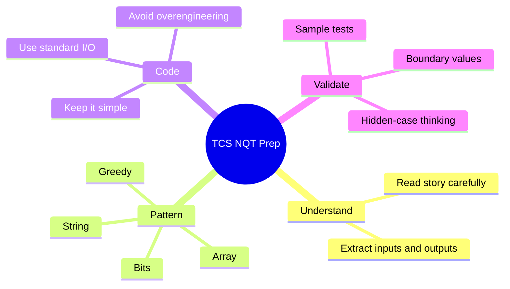

<div align="center">


[](https://isocpp.org/)


</div>

---

## Project Snapshot

This repository is a focused C++ workspace for **TCS NQT Advanced Coding** preparation.  
Each file solves one story-based coding problem and maps it to a recognizable DSA pattern so the logic becomes easier to reuse in the real exam.


## Problem Index

| File | Problem Theme | Core Pattern | Related Practice |
| --- | --- | --- | --- |
| `Q_01.cpp` | Move empty chocolate packets to the end | Array rewrite / two pointers | LeetCode 283 |
| `Q_02.cpp` | Toggle all binary bits of a number | Bit manipulation / mask | LeetCode 476 |
| `Q_03.cpp` | Count Sundays from a starting weekday | Hash map / modular thinking | LeetCode 1185 |
| `Q_04.cpp` | Sort risk levels `0`, `1`, `2` | Dutch National Flag | LeetCode 75 |
| `Q_05.cpp` | Count elements greater than all previous elements | Prefix maximum | Similar to ocean-view style logic |
| `Q_06.cpp` | Product of digits as item price | Digit processing | LeetCode 1281 concept |
| `Q_07.cpp` | Max count of `a` in fixed-size chunks | Chunk traversal | Window-style counting |
| `Q_08.cpp` | Upcoming solution slot | To be added | To be added |

## Tech Stack

<p align="center">
  
</p>

- **Language:** C++
- **Standard:** C++17 / C++20 friendly
- **Input style:** Standard input with `cin`
- **Output style:** Console output with `cout`
- **Focus areas:** arrays, strings, bit manipulation, greedy logic, prefix tracking, chunk/window traversal

## How To Run

Compile any question file with `g++`:

```bash
g++ Q_01.cpp -o Q_01
./Q_01
```

On Windows PowerShell:

```powershell
g++ .\Q_01.cpp -o .\Q_01.exe
.\Q_01.exe
```

Replace `Q_01.cpp` with whichever problem you want to test.

## Practice Method



## Progress Board

| Area | Status |
| --- | --- |
| Array basics | Done |
| Two-pointer logic | Done |
| Bit manipulation | Done |
| String traversal | Done |
| Prefix maximum | Done |
| More advanced patterns | In progress |

## Repository Structure

```text
TCS_NQT_DSA/
|-- Q_01.cpp
|-- Q_02.cpp
|-- Q_03.cpp
|-- Q_04.cpp
|-- Q_05.cpp
|-- Q_06.cpp
|-- Q_07.cpp
|-- Q_08.cpp
`-- README.md
```

## Goal

The aim is not just to memorize solutions.  
The aim is to recognize the hidden DSA pattern behind each TCS-style story problem and solve it with clean, efficient C++.

<div align="center">


**Master the pattern. Solve the problem. Build the confidence.**

</div>
